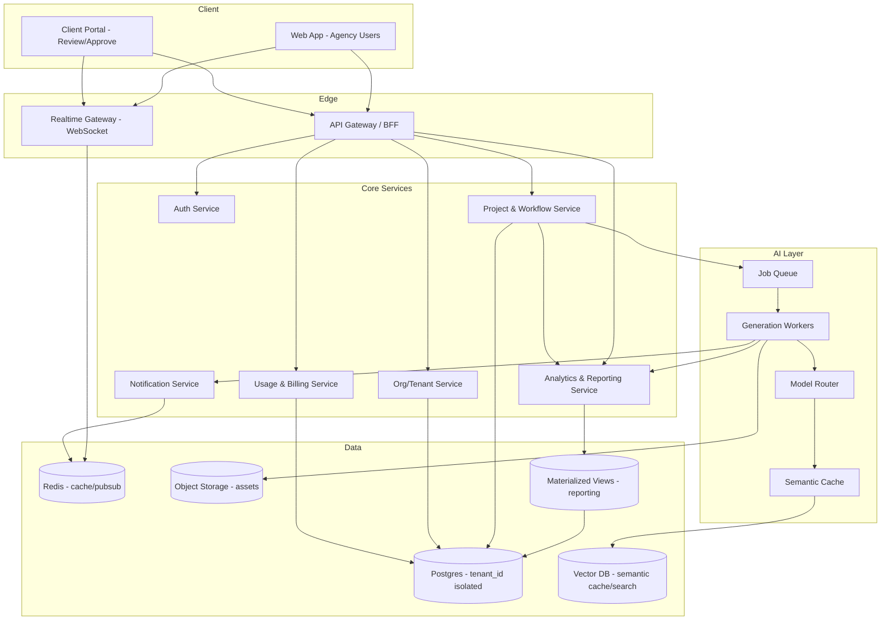

# System Design: AI-Powered Creative Agency Platform

**Document type:** System Design / Architecture Specification
**Purpose:** Portfolio piece (senior/staff-level system design) — also usable as a real client proposal
**Core value proposition:** A platform where creative agencies and their clients collaborate on briefs and projects, with AI generating first-draft content (copy, images, video) inside the workflow instead of as a separate tool.

---

## 1. Problem Statement & Scope

Creative agencies lose time in two places: (1) producing first drafts of content, and (2) chasing approvals across email/Slack/shared drives. This platform attacks both:

- **AI Content Generation** — turns a brief into a first-draft asset (text, image, or video) inside the same tool the team already works in.
- **Workflow & Collaboration** — briefs → tasks → drafts → client review → approval, with real-time updates instead of status-check pings.

**Explicitly out of scope for v1:** payments/marketplace matching, video editing suite, white-label reselling. These are natural Phase 3+ extensions, not core.

### Non-functional requirements (these drive most of the interesting design decisions)
| Requirement | Target |
|---|---|
| AI generation latency | Text: streamed, <2s to first token. Image: async, <30s typical. Video: async, minutes, job-based. |
| Availability | 99.9% for core workflow; AI generation degrades gracefully (queue, don't fail) during provider outages |
| Multi-tenancy | Every tenant's data (briefs, assets, client comments) must be provably isolated |
| Cost control | AI spend must be capped and attributable per tenant — this is the #1 way these platforms go bankrupt |
| Scale target | Design for 1,000–5,000 agencies, ~50 users each, with a clear path to 10x without a rewrite |

---

## 2. Recommended Scale Posture

You weren't sure what scale to target — here's the recommendation and why it matters for a portfolio piece specifically:

**Design as multi-tenant SaaS from day one, but build/deploy only what Phase 1 needs.**

This is deliberate, not indecisive: the *costliest* mistake in real systems is treating multi-tenancy as something you "add later" — retrofitting tenant isolation into a single-tenant data model is one of the most common (and expensive) rewrites in industry. Designing the tenant boundary in from the start costs almost nothing up front (one `tenant_id` column, one auth claim) and is exactly the kind of judgment call that signals seniority in an interview — you're not over-building, you're avoiding a specific known trap.

---

## 3. High-Level Architecture

---

## 4. Core Component Deep Dives

### 4.1 AI/LLM Pipeline & Cost Control
This is the component most likely to be scrutinized in an interview, because it's where "just call the OpenAI API" naively falls apart at scale.

- **Async-first**: every generation request becomes a job. Text can stream directly for UX, but is still logged as a job for cost accounting. Image/video are always job + webhook/websocket notification — never a blocking HTTP call.
- **Model Router**: abstracts away the provider. Picks a model per task type (fast/cheap model for drafts, higher-quality model on explicit "improve this" requests), and defines a fallback chain if a provider errors or rate-limits.
- **Cost control (the real design problem)**:
  - Per-tenant credit ledger, checked *before* a job is dispatched, not after.
  - Semantic caching: embed the prompt, check a vector store for a near-duplicate prior request within a similarity threshold, serve cached result instead of re-generating. This alone typically cuts AI spend significantly for repetitive brief patterns.
  - Hard per-tenant rate limits and budget alerts, separate from the soft UX-facing quota.
- **Failure mode to design for explicitly**: a provider outage or price spike shouldn't take down the whole platform — jobs queue and retry with backoff, and the UI shows "queued" rather than erroring.

### 4.2 Workflow & Collaboration
- **Data shape**: `Organization → Project → Brief → Task → Asset (versions) → Comment/Approval`.
- **Realtime**: a pub/sub layer (Redis, or a managed service like Ably/Pusher for the portfolio-scale version) fans out status changes, comments, and "someone is viewing/editing this" presence to connected clients over WebSocket.
- **Client Portal** is a scoped, read/comment/approve-only view into the same data — this is where tenant + role-based access control actually gets exercised, which is worth calling out explicitly in the design (it's not just "agency users," there's a second, more restricted actor type).

### 4.3 Multi-Tenancy & Security
- **v1 approach**: shared database, `tenant_id` on every table, enforced via Postgres Row-Level Security (not just application-layer filtering — RLS means a bug in application code can't leak cross-tenant data).
- **Growth path**: schema-per-tenant or dedicated database for enterprise clients who need it contractually (common ask once you have a client with compliance requirements). Name this explicitly as a *planned* migration, not something you're building now.
- **AuthN/AuthZ**: OIDC-based auth, JWT carrying `tenant_id` + `role` claims. Roles: agency-admin, agency-editor, client-approver, client-viewer.
- **Audit log** on approvals and asset changes — clients will ask for this before signing a contract.

### 4.4 Analytics & Reporting
This is where the platform stops being "just a CRUD app with AI calls" and starts producing decisions, which is a distinct and valuable skill set to demonstrate alongside the backend/AI work.

- **Agency-facing dashboard**: brief → approval turnaround time, generation volume by content type, revision count per draft (a proxy for AI output quality).
- **Platform-owner dashboard**: AI spend per tenant per period, semantic cache hit rate (concrete evidence of cost savings), tenant activity/engagement trends — this closes the loop with the cost-control design in 4.1 by making it *visible*, not just enforced.
- **Data path**: raw events (job completed, draft revised, approval granted) are written once, at the point they happen, into an append-only events table — never computed retroactively. Materialized views are refreshed on a schedule (via the existing job queue, not a separate cron system) to pre-aggregate the numbers dashboards actually query, so dashboards never run expensive raw aggregation live.
- **Why materialized views over live queries**: at multi-tenant scale, a dashboard that aggregates raw event rows on every page load is the first thing that falls over under load. Precomputing on a schedule trades a small amount of staleness (e.g., 15 minutes) for dashboards that stay fast regardless of data volume — a trade-off worth stating explicitly in an interview.

### 4.5 Scalability & Performance
- Stateless app services behind a load balancer, horizontally autoscaled.
- The job queue is the load-shedding mechanism: AI generation demand spikes get absorbed by queue depth, not by the API tier falling over.
- Postgres: connection pooling (PgBouncer) early; read replicas and partitioning are a documented *next step*, not a v1 requirement — naming the trigger condition ("shard when any single tenant's asset table passes X rows") is more convincing than building it prematurely.
- CDN in front of object storage for asset delivery.

---

## 5. Phased Roadmap

| Phase | Goal | Key deliverables |
|---|---|---|
| **0 — Foundations** | Tenant-safe skeleton | Auth, org/tenant model with RLS from day one, basic project/task CRUD |
| **1 — MVP** | Prove the core loop | Single AI content type (text) generation, brief → draft → approve flow, one tenant type fully working end-to-end |
| **2 — Multi-modal + Realtime** | Make it feel alive | Image/video generation via job queue, WebSocket-based realtime collaboration, notifications |
| **3 — Cost & Trust** | Make it sustainable and sellable | Per-tenant billing/usage metering, semantic caching, audit logs, client portal hardening |
| **3.5 — Analytics & Reporting** | Turn tracked data into decisions | Event tracking pipeline, scheduled materialized views, agency + platform-owner dashboards |
| **4 — Enterprise-ready** | Make it sellable to bigger clients | Dedicated-tenancy option, SSO, advanced observability, SLA-backed uptime |

---

## 6. Dependencies

- **Billing (Phase 3) depends on** AI job instrumentation existing since Phase 1 (you can't bill for usage you never measured) — so cost/usage logging should be built into the job queue from Phase 1 even though billing itself ships in Phase 3.
- **Realtime collaboration (Phase 2) depends on** the pub/sub layer existing, which depends on Redis being in place from Phase 0 (it's cheap to add early, expensive to bolt on once multiple services assume its absence).
- **Enterprise dedicated-tenancy (Phase 4) depends on** the Phase 0 decision to key everything by `tenant_id` — this is the dependency that justifies front-loading the multi-tenancy decision.
- **Semantic caching (Phase 3) depends on** the vector store being provisioned, which can be deferred, but the embedding step in the generation pipeline should be designed in from Phase 1 so it isn't a rewrite later.
- **Analytics dashboards (Phase 3.5) depend on** event logging existing since Phase 1 — the same principle as billing: you cannot retroactively reconstruct "time from brief to approval" for data you never timestamped, so event writes should be added incrementally as each feature ships, not bolted on all at once before the dashboards are built.

---

## 7. Risks & Mitigations

| Risk | Mitigation |
|---|---|
| AI provider cost overrun | Pre-flight credit check, hard per-tenant budget caps, semantic caching |
| Single AI provider outage or rate-limiting | Model Router with fallback chain across providers; queue absorbs backpressure |
| Cross-tenant data leak | Postgres RLS (not just app-layer checks), automated isolation tests in CI |
| Realtime infra cost/complexity spiraling | Start with a managed pub/sub provider; only build in-house if usage justifies it |
| Scope creep (common in portfolio projects) | Timebox each phase; depth on one vertical slice beats shallow breadth across all four |
| Vendor lock-in to one AI provider | Model Router abstraction from day one, even with only one provider wired up initially |
| Dashboards querying raw data slow down under load | Precompute via scheduled materialized views instead of live aggregation; accept small staleness window |

---

## 8. Suggested Tech Stack

- **Backend**: NestJS (TypeScript) with Prisma as the ORM
- **Data**: Postgres (RLS), Redis (cache + pub/sub), S3-compatible object storage, a vector store (pgvector is enough — don't reach for a dedicated vector DB unless scale demands it)
- **Queue**: BullMQ (Redis-backed) — integrates natively with NestJS
- **Realtime**: NestJS Gateway with Socket.io
- **Frontend**: Next.js (App Router)
- **Analytics/Reporting**: Postgres materialized views for aggregation, Recharts for dashboard visualization on the Next.js frontend — no separate BI tool needed at this scale
- **Infra**: Docker + a single managed container platform (ECS/Fargate or similar) — Kubernetes is *optional* and only worth including if the job you're targeting specifically wants K8s experience shown

---

## 9. How to Use This for Interviews or Client Pitches

- The single strongest talking point here is **Section 2** — explicitly deciding to design multi-tenancy in from day one while deferring its harder implementation (schema-per-tenant, dedicated DB) to when a real client needs it. That's a trade-off judgment call, not just architecture recall.
- Second strongest: the **cost-control design in 4.1** — most candidates can describe "call an LLM API"; fewer can describe *why* naive AI integration bankrupts a product and what specifically prevents it.
- Third: the **Analytics & Reporting design in 4.4** — it demonstrates a skill most backend-focused candidates don't showcase (data modeling for reporting, materialized views, the trade-off between live queries and precomputed aggregates), which broadens the roles this portfolio piece is relevant for.
- If asked to go deeper in an interview, the areas worth having a whiteboard-ready answer for are: the semantic cache mechanics (how similarity threshold is chosen, staleness handling), the RLS policy design (what the actual SQL policy looks like), and the materialized view refresh strategy (why scheduled via the job queue rather than a database-native cron).
